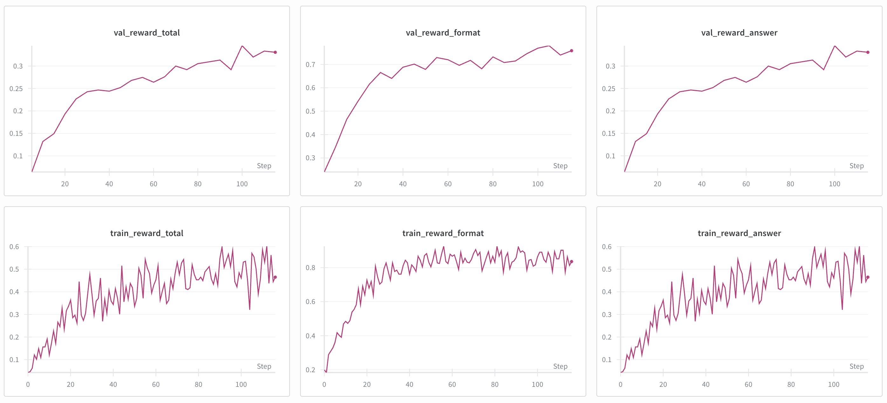

# Language Model Alignment with Reasoning RL

> **Note**: This is a personal implementation and educational project based on [CS336 Assignment 5 (Spring 2025)](./cs336_spring2025_assignment5_alignment.pdf) from Stanford University. This is not the official assignment repository.

This repository implements language model alignment techniques for mathematical reasoning. The project progressively trains language models using Supervised Fine-Tuning (SFT), Expert Iteration, and Group Relative Policy Optimization (GRPO) to solve challenging mathematical problems from the MATH dataset.

## 📋 Overview

This is a working implementation of modern language model alignment techniques for mathematical reasoning. The project was developed as a personal learning exercise based on CS336 Assignment 5, and includes full training pipelines tested on Google Colab with A100 GPUs (free for .edu accounts).

### What's Implemented

This project demonstrates three key alignment algorithms applied to mathematical reasoning:

1. **Supervised Fine-Tuning (SFT)**: Train on reasoning traces from a stronger model (DeepSeek R1)
2. **Expert Iteration**: Iteratively sample responses, filter correct ones, and train on self-generated data
3. **GRPO (Group Relative Policy Optimization)**: Reinforcement learning with verified rewards and group normalization

**Base Model**: [Qwen 2.5 Math 1.5B](https://huggingface.co/Qwen/Qwen2.5-Math-1.5B) - A specialized model designed for mathematical reasoning

**Dataset**: [MATH Dataset](https://github.com/hendrycks/math) - Competition-level mathematics problems (not included in repo, download separately)

### About This Implementation

All algorithms are implemented from scratch using PyTorch, with helper functions for:
- **Tokenization & Data Processing**: Custom prompt formatting and response masking
- **SFT Training**: Gradient accumulation, loss computation, checkpointing
- **RL Training**: Group reward normalization, advantage estimation, policy gradients
- **Evaluation**: vLLM-based generation, mathematical answer grading

The code is tested and runs on a single A100 80GB GPU using Google Colab.

## 🔬 Algorithm Overview

The training follows a progressive curriculum:

```
Base Model (Qwen 2.5 Math 1.5B)
    
[1] Supervised Fine-Tuning (SFT)
    • Train on reasoning traces from DeepSeek R1
    • Learn to generate step-by-step solutions
    • Output: SFT checkpoint
    
[2] Expert Iteration
    • Sample multiple solutions per problem
    • Filter correct responses using verified rewards
    • Train on filtered self-generated data
    • Iterate to improve policy
    • Output: Improved checkpoint
    
[3] GRPO (Group Relative Policy Optimization)
    • On-policy RL with group-normalized rewards
    • Multiple responses per prompt (group_size=8)
    • Advantage estimation with group baselines
    • Policy gradient optimization
    • Output: Final aligned model
```

### Algorithm Details

- **SFT**: Standard next-token prediction on expert demonstrations with gradient accumulation
- **Expert Iteration**: Bootstrap reasoning by filtering correct self-generated responses and training on them
- **GRPO**: Policy gradient RL where advantages are computed by normalizing rewards within groups of responses to the same prompt

All algorithms use:
- **vLLM** for efficient inference and response generation
- **Verified Rewards** based on mathematical answer correctness (using `math-verify` library)
- **Gradient Clipping** (max_norm=1.0) for stable training
- **WandB Logging** for experiment tracking

## 🚀 Getting Started

### Prerequisites

- **Python**: 3.12 
- **GPU**: A100 80GB used (free used on Google Colab with .edu accounts)
- **CUDA**: Compatible CUDA version for PyTorch and vLLM

### Installation

This project uses [uv](https://github.com/astral-sh/uv) for fast dependency management.

1. **Clone the repository**:
```bash
git clone https://github.com/HaoliangCheng/alignment_public.git
cd alignment_public
```

2. **Install dependencies**:
```bash
# Install all packages except flash-attn first (flash-attn requires special handling)
uv sync --no-install-package flash-attn

# Then install flash-attn
uv sync
```

3. **Login to WandB** (for experiment tracking):
```bash
wandb login
```

### Data Setup

The MATH dataset is **not included** in this repository (added to `.gitignore`). You need to download it separately.

**Option 1: Use the provided download script**
```bash
uv run python data/download_db.py
```

**Option 2: Manual download**
```bash
# Download from official source
mkdir -p data/MATH
cd data/MATH

# Download train and test splits
wget https://people.eecs.berkeley.edu/~hendrycks/MATH.tar
tar -xvf MATH.tar

# Create SFT training data (with R1 reasoning traces)
cd ../..
uv run python data/create_sft_data.py
```

The data directory structure should look like:
```
data/
├── MATH/
│   ├── train.jsonl          # Original training problems
│   ├── test.jsonl           # Test problems for evaluation
│   ├── sft.jsonl            # SFT data with R1 reasoning traces
│   ├── sft_train.jsonl      # SFT training split
│   ├── sft_val.jsonl        # SFT validation split
│   └── sft_train_filtered.jsonl  # Filtered correct examples
```

## 🎯 Training Pipeline

### 1. Baseline Evaluation 

Test the zero-shot performance of the base model:

```bash
uv run python alignment/baseline.py 
```

**Expected Output**: Baseline accuracy metrics saved to `baseline_results_summary.json`

### 2. Supervised Fine-Tuning (SFT)

Train on reasoning traces from DeepSeek R1:

```bash
uv run python alignment/sft.py 
```

**Key Parameters**:
- `batch_size=4` with `gradient_accumulation_steps=4` → effective batch size = 16
- `max-length=512`: Maximum sequence length for training
- `gradient-clip-value=1.0`: Gradient clipping for stability
- Checkpoints saved every 500 steps to `sft_output/checkpoint-*`


### 3. Expert Iteration

Iteratively improve the model by training on filtered self-generated correct responses:

```bash
uv run python alignment/expert_iteration.py 
```

**Algorithm Steps** (repeated for each EI step):
1. Sample `batch_size` questions from training set
2. Generate `num_rollouts` responses per question using current policy
3. Compute rewards and filter correct responses
4. Run SFT on filtered responses for `sft_epochs` epochs
5. Evaluate on validation set
6. Save checkpoint

**Key Parameters**:
- `n-ei-steps=5`: Number of expert iteration cycles
- `batch-size=512`: Questions sampled per EI step
- `num-rollouts=4`: Responses generated per question (total: 512 × 4 = 2048 responses)
- Checkpoints saved after each EI step to `expert_iteration_output/checkpoint_ei_step_*`


### 4. GRPO (Group Relative Policy Optimization)

Fine-tune with reinforcement learning using verified rewards:

```bash
uv run python alignment/grpo.py 
```

**Algorithm Details**:
- **On-Policy Sampling**: Load current policy weights into vLLM before each rollout
- **Group Normalization**: Generate `group_size` responses per prompt, normalize rewards within groups
- **Advantage Estimation**: `advantage = (reward - group_mean) / (group_std + eps)`
- **Loss Types**:
  - `no_baseline`: REINFORCE with raw rewards
  - `reinforce_with_baseline`: REINFORCE with advantage (recommended)
  - `grpo_clip`: PPO-style clipped objective

**Key Parameters**:
- `rollout-batch-size=256`: Total responses per GRPO step
- `group-size=8`: Responses per prompt (256 / 8 = 32 unique prompts)
- `train-batch-size=256` with `gradient-accumulation-steps=128` → microbatch size = 2
- Checkpoints saved every 50 steps to `grpo_output/checkpoint_step_*`


## 🧪 Testing

Run unit tests to verify helper functions and core algorithms:

```bash
# Run all tests
uv run pytest

# Run specific test modules
uv run pytest tests/test_sft.py
uv run pytest tests/test_grpo.py

# Run with verbose output
uv run pytest -v
```

**Test Coverage**:
- `test_sft.py`: SFT tokenization, loss computation, training steps
- `test_grpo.py`: Reward computation, advantage estimation, GRPO loss functions


## 📊 Monitoring Training

### WandB Integration

All training scripts support WandB logging. View metrics at [wandb.ai](https://wandb.ai):

**SFT Metrics**:
- `train/loss`: Training loss
- `train/learning_rate`: Current learning rate
- `eval/accuracy`: Validation accuracy
- `eval/format_reward`: Percentage with correct answer format

**Expert Iteration Metrics**:
- `ei/avg_reward`: Average reward on sampled responses
- `ei/filtered_samples`: Number of correct responses kept
- `ei/sft_loss`: Loss during SFT phase
- `ei/eval_accuracy`: Validation accuracy after each EI step

**GRPO Metrics**:
- `train_reward_total`: Total reward (format + answer)
- `train_reward_answer`: Answer correctness
- `train_reward_format`: Format correctness
- `val_reward_*`: Validation rewards every 5 steps

**Example Training Progress** (GRPO on MATH dataset with default parameters):



*Training results using default parameter settings from the script.*

The plots show:
- **Validation metrics** (top row): Steady improvement in total reward (~0.33), format correctness (~0.75), and answer correctness (~0.33) over 120+ steps
- **Training metrics** (bottom row): On-policy rewards with natural variance from sampling, showing format reward ~0.8 and answer reward ~0.4-0.5


## 🔧 Hardware Requirements

### Tested Configuration

- **Platform**: Google Colab Pro/Pro+ (free for .edu accounts)
- **GPU**: A100 80GB 


## 📂 Project Structure

```
alignment_public/
├── alignment/                    # Main training code
│   ├── baseline.py              # Zero-shot baseline evaluation
│   ├── sft.py                   # Supervised fine-tuning
│   ├── expert_iteration.py      # Expert iteration training
│   ├── grpo.py                  # GRPO training loop
│   ├── helper.py                # SFT utilities (tokenization, loss)
│   ├── helper_rl.py             # RL utilities (advantages, GRPO loss)
│   ├── drgrpo_grader.py         # Reward functions and answer grading
│   └── prompts/                 # Prompt templates
│       ├── r1_zero.prompt       # R1-style reasoning prompt
│       ├── question_only.prompt # Simple question prompt
│       └── ...
├── data/                         # Datasets (MATH excluded from git)
│   ├── download_db.py           # Script to download MATH dataset
│   ├── create_sft_data.py       # Generate SFT training data
│   └── split_sft_data.py        # Split data into train/val
├── tests/                        # Unit tests
│   ├── test_sft.py              # SFT tests
│   ├── test_grpo.py             # GRPO tests
│   ├── test_data.py             # Data loading tests
│   ├── adapters.py              # Test adapters for your implementation
│   └── _snapshots/              # Test reference outputs
├── cs336_spring2025_assignment5_alignment.pdf  # Assignment handout
├── pyproject.toml               # Project dependencies
├── uv.lock                      # Locked dependency versions
├── .gitignore                   # Excludes MATH dataset, models, results
└── README.md                    # This file
```

## 📚 Key Technologies

- **[PyTorch](https://pytorch.org/)**: Deep learning framework
- **[Transformers](https://huggingface.co/transformers)**: Model loading and training utilities
- **[vLLM](https://github.com/vllm-project/vllm)**: Fast LLM inference and generation
- **[Flash Attention 2](https://github.com/Dao-AILab/flash-attention)**: Efficient attention computation
- **[WandB](https://wandb.ai/)**: Experiment tracking and visualization
- **[math-verify](https://github.com/JoshuaPurtell/verify)**: Mathematical answer verification
- **[uv](https://github.com/astral-sh/uv)**: Fast Python package manager

## 🎓 References

This project is a personal educational implementation based on concepts from:

1. **CS336 Assignment 5** (Spring 2025) - Stanford University: [cs336_spring2025_assignment5_alignment.pdf](./cs336_spring2025_assignment5_alignment.pdf)
2. **DeepSeek-R1** (DeepSeek-AI et al., 2025): Reasoning reinforcement learning for math and code
3. **MATH Dataset** (Hendrycks et al., 2021): Competition mathematics problems
4. **STaR** (Zelikman et al., 2022): Self-Taught Reasoner with expert iteration
5. **GRPO/DeepSeekMath** (Shao et al., 2024): Group relative policy optimization

### Key Papers

- [Chain-of-Thought Prompting](https://arxiv.org/abs/2201.11903) (Wei et al., 2023)
- [Self-Taught Reasoner (STaR)](https://arxiv.org/abs/2203.14465) (Zelikman et al., 2022)
- [DeepSeekMath](https://arxiv.org/abs/2402.03300) (Shao et al., 2024)
- [Qwen2.5-Math](https://arxiv.org/abs/2409.12122) (Yang et al., 2024)
- [DeepSeek-R1](https://arxiv.org/abs/2501.12948) (DeepSeek-AI et al., 2025)

## 🙏 Acknowledgments

This project is based on **CS336: Language Modeling from Scratch** (Spring 2025) at Stanford University. Special thanks to the CS336 course staff for designing the assignment and providing the foundational framework.

**Original Assignment**: [Stanford CS336 Assignment 5](./cs336_spring2025_assignment5_alignment.pdf)

## 🤝 Contributing

This is a personal educational project. If you find bugs or have improvements:

1. Open an issue describing the problem
2. Submit a pull request with fixes
3. Ensure tests pass: `uv run pytest`

## 📝 License

This project is for educational purposes. Please refer to the original CS336 course materials for licensing terms.

## 💡 Tips & Tricks

### Google Colab Setup

1. **Get free A100 access**: Use your .edu email to sign up for Colab
2. **Mount Google Drive** for persistent storage:
```python
from google.colab import drive
drive.mount('/content/drive')
```
3. **Set output directory to Drive**:
```bash
--output-dir /content/drive/MyDrive/math_alignment/sft_output
```
4. **Monitor GPU usage**:
```python
!nvidia-smi
```

---

## 📞 Questions?

For questions or discussions about this implementation:
- Open a GitHub issue for bugs or feature requests
- Refer to the [CS336 Assignment 5 PDF](./cs336_spring2025_assignment5_alignment.pdf) for technical details
- Check the original [Stanford CS336 course materials](https://stanford-cs336.github.io/) for more context

**Happy Training! 🚀**
